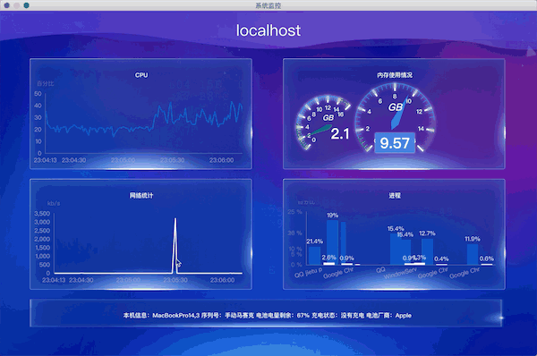

# carlo-simple-demo
## 什么是carlo
GoogleChromeLabs 的 Git 仓库里新增了一个名为 Carlo 的仓库，官方对它的描述是：
 > Carlo provides Node applications with Google Chrome rendering capabilities, communicates with the locally-installed browser instance using the Puppeteer project, and implements a remote call infrastructure for communication between Node and the browser.

可以让node程序使用web来渲染页面。
[carlo传送门](https://github.com/GoogleChromeLabs/carlo)

## 本demo的介绍
这个demo是使用carlo制作的一款监控本地电脑的一个图形化界面程序

## 使用
```bash
git clone https://github.com/sclihuiming/carlo-simple-demo
cd carlo-simple-demo
npm i
# node app 或者 npm start
npm start 
```
### ⚠️ 注意
* node的版本需要在7.6.0以上
* 本地必须有chrome浏览器，如果没有会报错
* chrome的版本最好和官方保持同步

## 示例
